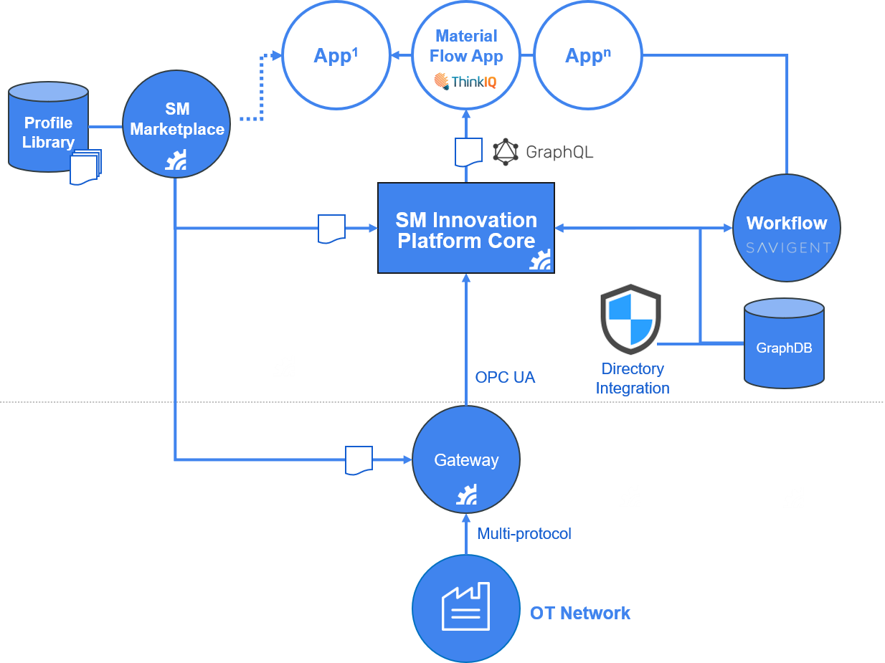
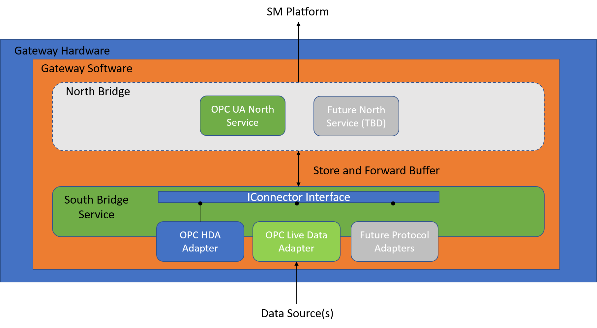

# SM Edge Gateway Connectors
The SM Edge Gateway is a small, on-prem component of the SM Platform that facilitates secure, high-speed ingress of data into the SM Platform.

This diagram shows the high-level components of the SMIP. The Gateway (also known as the SM Edge, SM Edge Gateway, or simply the Connector) connects to multiple plant floor (or more generically OT, or Operational Technology) data sources, to secure transmit data to the core Platform.

The Gateway uses an extensible approach to protocol adaptation through the use of Connector Adapters. Connectors can be used to adapt a variety of datasources to to the Gateway, which provides store-and-forward and secure data tranmission. In today's implementation, the secure outbound (to the core) connection is a function of the "North Bridge" and works via a OPC UA Service that supports reverse tunnelling. Future northbound services may be added in later versions. The inbound (to the gateway) connection is a function of the "South Bridge" which works by instantiating a Connector Adapter. With this pattern a wide array of protocols and interfaces can be adapted to the Gateway. Currently the SMIP supports historical data sources, such as OPC HDA, OSI Pi and Wonderware Historian. Later in 2021, an adapter will be added for OPC live data Sources, including OPC DA and OPC UA LiveData.

If none of the supported protocols work for a given project, the Connector Adapter can be "swapped out" with a new adapter that meets those requirements. The Sample contained here illustrates how to build your own Connector Adapter, using the cross-platform .NET Core runtime and C#. 

## Lifecycle
As you look through the code, it may be helpful to understand the basic stages of the Connector's life cycle
- Instantiation: the Gateway's South Bridge service calls your ConnectoryFactory to create an Instance of your Connector
- Connect: the South Bridge service calls your Connector's Connect method to instruct it to make a connection to your data source
- Browse: the South Bridge service calls your Connector's Browse method to get a list of tags (data points) your Connector can provide
- CreateReader: the South Bridge service creates one or more instances of your Reader to service sets of tags configured for ingress
- Read: The South Bridge services calls your Reader's Read method to gather samples for the set of tags that Reader instance was created to service
- Dispose: Your Reader instance is no longer needed and can clean-up
- Disconnect: Your Connector is no longer needed and can Disconnect from the data source

## Additional information
Review the code comments and supplementary .md files for further information on creating, [installing](installation.md) and [configuring](appsettings.md) Connectors.
