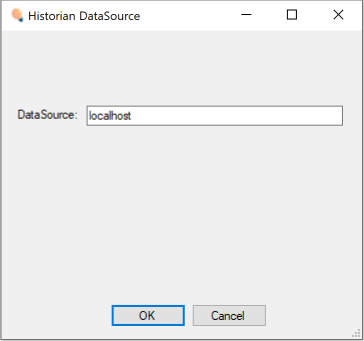
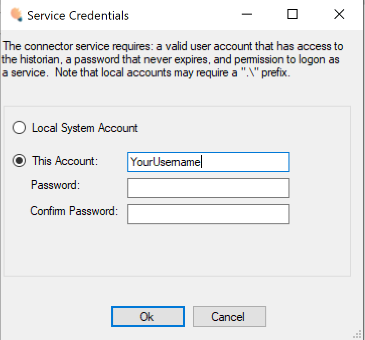
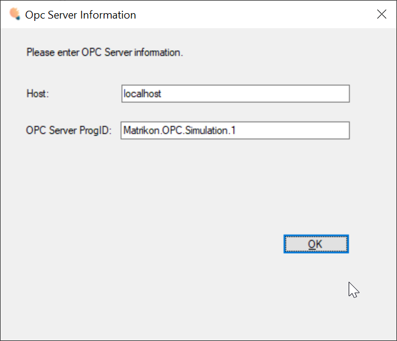
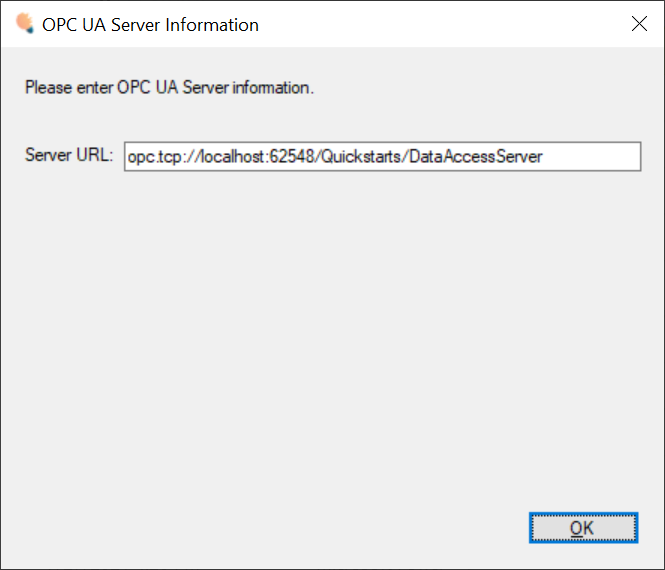

# Existing Connector Adapters

Before building your own custom Connector Adapter, review the following list and installation tips to see if one of the existing connectors work for you.
In all cases, you'll first need to create a Connector record in the web UI of your platform instance to download the install package and generate the necessary activation code.

## Windows Connectors

### Wonderware Historian

Supports connecting to a remote Historian server. During installation you'll be prompted for server location and credentials...

### OSI Pi Historian

- Pre-requisites
    + Install the [OPC .NET Redistributable](https://cesmii.net/installers/OPC.NetRedist.msi)
    + Install the [OPC Core Components Redistributable](https://cesmii.net/installers/OPCCoreRedist.msi)

### OPC HDA

### OPC DA (Classic)

Supports configurable OPC DA Server. During installation you'll be prompted for server details...

### OPC UA Live Data

Supports configurable OPC UA Server Endpoint. During installation you'll be prompted for server details...

## Linux Connectors

### OPC UA Live Data

- Install the connector its DEB package, supplying the Activation code when prompted:
    + `sudo apt install ./tiq-gateway.deb`
- Bits will be installed to `/opt/thinkiq`
- Modify the file `/opt/thinkiq/services/SouthBridgeService/ThinkIQ.Opc.Ua.Connector.Endpoints.xml`
    + Edit Endpoint URL to point to your OPC UA server: `<EndpointUrl>opc.tcp://localhost:62548/Quickstarts/DataAccessServer</EndpointUrl>`
